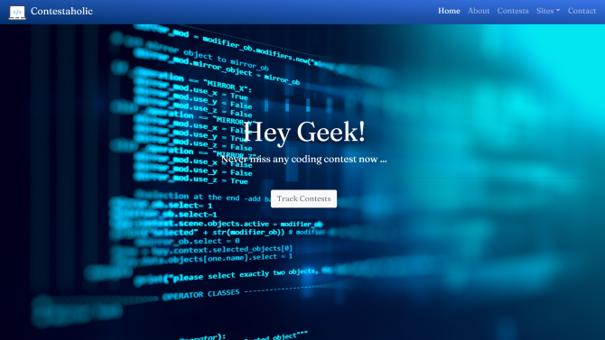
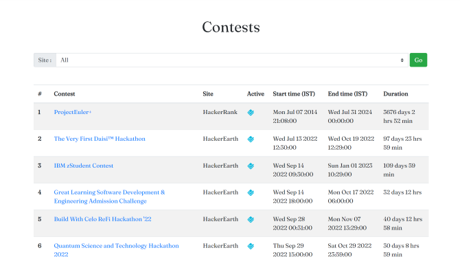

# Contestaholic
A responsive website developed using *HTML*, *CSS*, and *JS* to get details of all ongoing and upcoming competitive programming contests. It fetches the contest details from a *REST API* and presents them according to the filters applied.

    
    

## Live Link
[Website](https://ujjwalkumar8577.github.io/Contestaholic)

## Demo
[YouTube](https://youtu.be/uw6bguqvqKc)

## API Used
[KONTESTS](https://kontests.net/api)